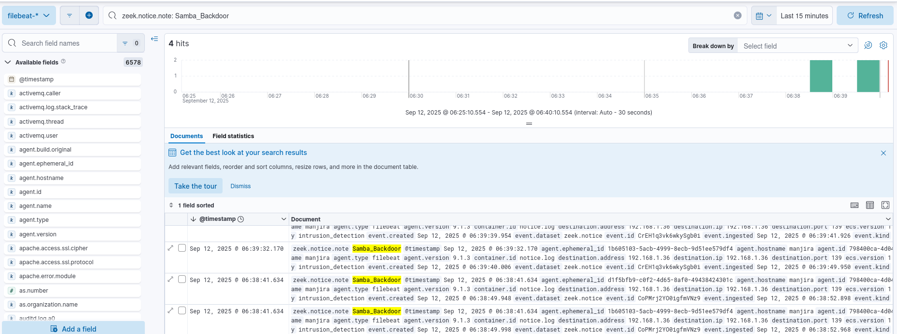
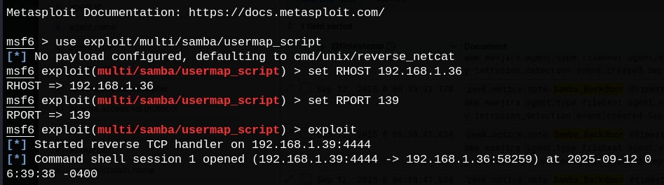
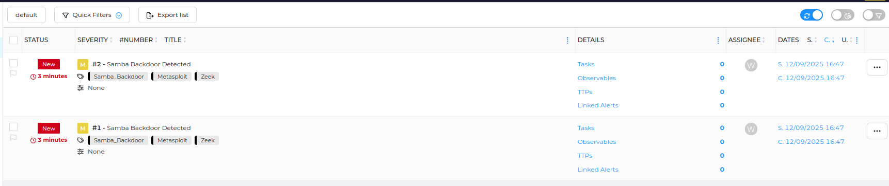
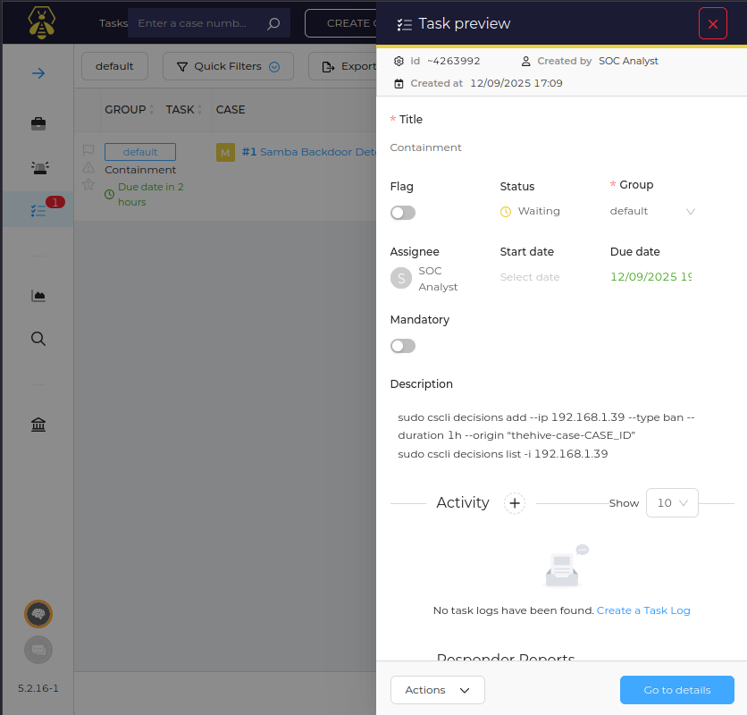
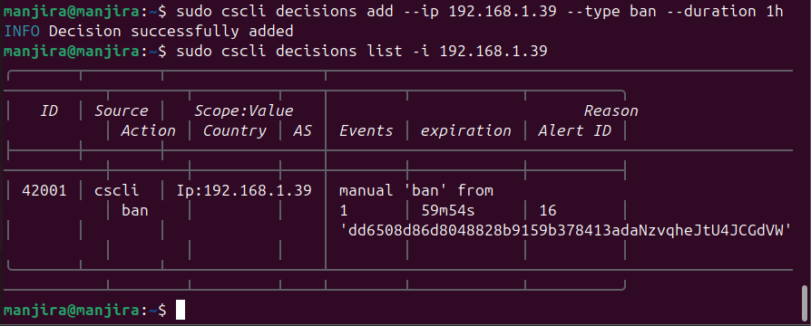
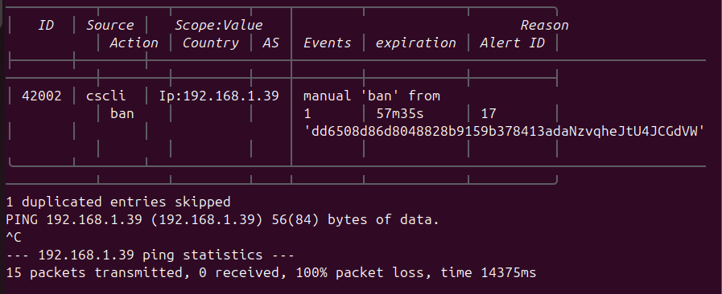
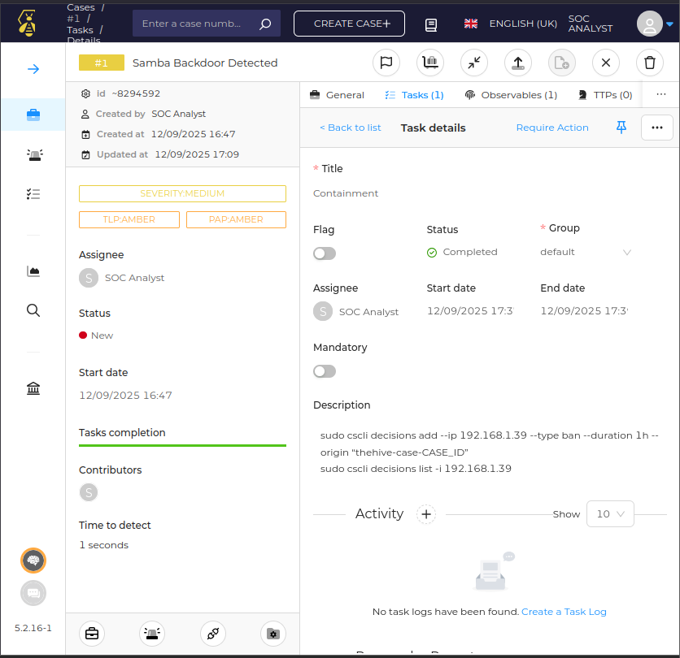
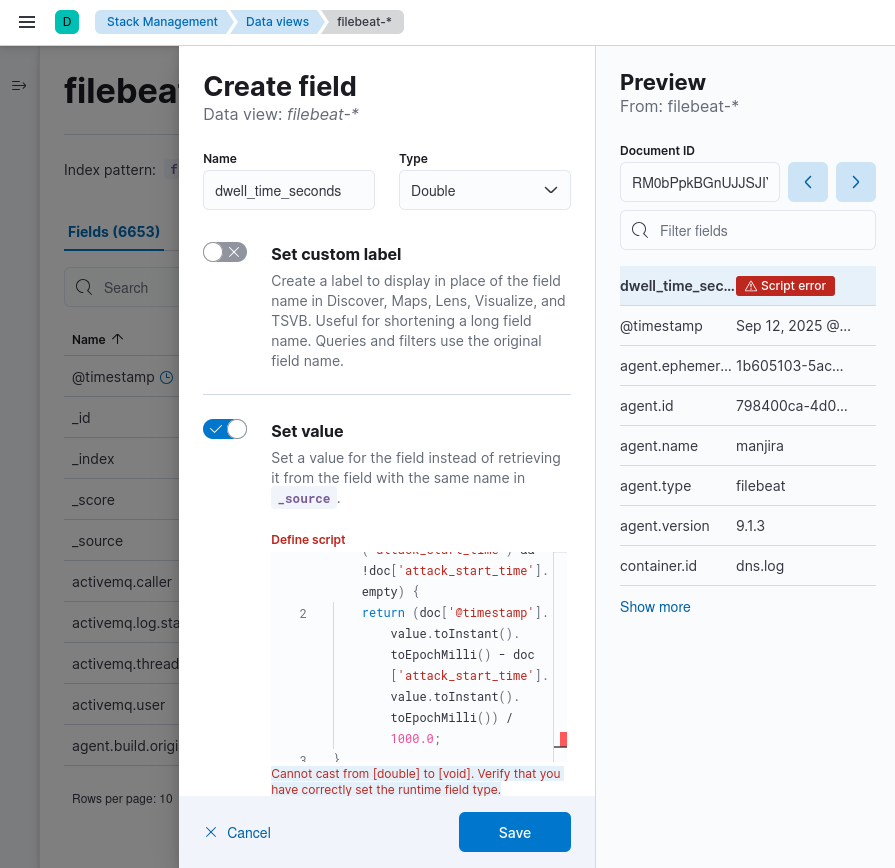
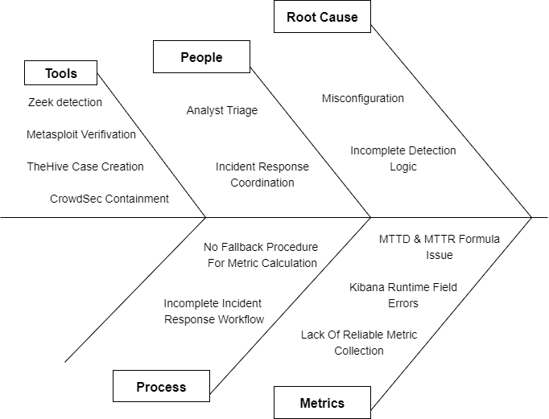

# SOC Incident Response Capstone: Samba Exploit Investigation

## Project Overview

This repository documents a simulated Security Operations Center (SOC) incident response investigation involving the exploitation of the Samba `usermap_script` vulnerability. The objective was to detect malicious SMB activity, investigate the attack, validate the exploitation, perform containment, and document the complete incident response lifecycle.

The attack was simulated in a controlled lab environment using the Metasploit Framework against a vulnerable Samba host. Network traffic was monitored using Zeek, security events were analyzed in Kibana (ELK Stack), incident management was performed in TheHive, and containment was executed using CrowdSec by blocking the attacker's IP address.

Throughout the investigation, evidence was collected from multiple security tools to validate the attack, correlate events, and document the incident. A post-incident analysis was conducted using the **5 Whys** methodology and a **Fishbone (Ishikawa) Diagram** to identify the underlying causes and recommend security improvements.

### Skills Demonstrated

- Security Monitoring and Alert Triage
- Network Traffic Analysis with Zeek
- Log Analysis using Kibana (ELK Stack)
- Incident Management with TheHive
- Attack Validation in a Controlled Lab Environment using Metasploit
- Threat Containment using CrowdSec
- Root Cause Analysis (RCA)
- Incident Documentation and Reporting
- MITRE ATT&CK Mapping
- Security Recommendations and Lessons Learned

> **Note:** This project was originally completed as the capstone project during my SOC Analyst internship and has been restructured into a standalone repository with improved documentation and organization for portfolio purposes.

---

# Lab Architecture

```text
Attacker (Metasploit)
        │
        ▼
Vulnerable Samba Host
        │
        ▼
      Zeek IDS
        │
        ▼
 ELK Stack (Kibana)
        │
        ▼
      TheHive
        │
        ▼
     CrowdSec
        │
        ▼
 Firewall Bouncer
```

---

# Attack Scenario

A vulnerable Samba server was targeted using the Metasploit `usermap_script` exploit module.

The attack generated suspicious SMB traffic, which was detected by Zeek through a custom `Samba_Backdoor` notice. The security events were investigated in Kibana, documented within TheHive, and successfully contained by manually blocking the attacker's IP address using CrowdSec.

---

# Tools Used

- Zeek IDS
- ELK Stack (Elasticsearch, Logstash, Kibana)
- TheHive
- CrowdSec
- Metasploit Framework
- Ubuntu Linux
- MITRE ATT&CK Framework

---

# MITRE ATT&CK Mapping

| Technique | ID |
|-----------|----|
| Exploitation of Remote Services | **T1210** |

---

# Investigation Workflow

## 1. Detection

Zeek detected the Samba exploit attempt and generated a custom `Samba_Backdoor` notice, which was ingested into Kibana for investigation.



---

## 2. Attack Validation

The exploit was successfully reproduced in the lab using the Metasploit Framework to validate the detection.



---

## 3. Incident Case Creation

A case was created in TheHive to document the investigation, manage observables, and coordinate incident response activities.



---

## 4. Task Assignment

A containment task was created within TheHive to track and document response actions.



---

## 5. Containment

CrowdSec Firewall Bouncer was used to manually block the attacker's IP address, preventing further communication with the target system.



---

## 6. Verification

Connectivity tests confirmed that the attacker IP address had been successfully blocked following containment.



---

## 7. Task Completion

Once containment and verification were completed, the investigation task was marked as complete within TheHive.



---

## 8. Challenges Encountered

During post-incident reporting, an attempt was made to calculate:

- Mean Time to Detect (MTTD)
- Mean Time to Respond (MTTR)
- Dwell Time

However, Kibana runtime fields produced the following error:

```text
Cannot cast from [double] to [void]
```

Because of inconsistent timestamp fields, these metrics could not be calculated. The issue was documented for future improvement and highlighted the importance of standardized event timestamps for operational reporting.



---

## 9. Post-Incident Analysis

A **5 Whys** analysis and **Fishbone (Ishikawa) Diagram** were used to determine the underlying causes of the incident and identify recommendations to improve the organization's security posture.



---

# Project Structure

```text
soc-incident-response-capstone/
│
├── README.md
│
├── docs/
│   ├── Incident_Report.md
│   ├── Investigation_Notes.md
│   └── Root_Cause_Analysis.md
│
└── Screenshots/
    ├── 01_Metasploit_Samba_Exploit.png
    ├── 02_Samba_Backdoor_Kibana_Logs.png
    ├── 03_TheHive_Cases.png
    ├── 04_Task_Creation.png
    ├── 05_Blocked_IP_With_Crowdsec.png
    ├── 06_Ping_Test_On_Blocked_IP.png
    ├── 07_Task_Complete.png
    ├── 08_Problem_Creating_Runtime_Field.png
    └── 09_RCA_Fishbone_Diagram.png
```

---

# Documentation

Additional project documentation is available in the `docs` directory:

- 📄 Incident Report
- 📄 Investigation Notes
- 📄 Root Cause Analysis

---

# Key Skills Demonstrated

- Security Monitoring
- Incident Detection
- Network Traffic Analysis
- Log Analysis
- Incident Response
- Alert Triage
- Threat Containment
- Root Cause Analysis
- SOC Case Management
- MITRE ATT&CK Mapping
- Technical Documentation

---

# Lessons Learned

- Zeek effectively detected suspicious SMB activity through custom detection logic.
- TheHive provided structured incident tracking and task management throughout the investigation.
- CrowdSec successfully contained the attack by blocking the malicious IP address.
- Manual validation confirmed the exploit before containment actions were taken.
- Accurate operational metrics such as MTTD and MTTR require consistent timestamp collection across security tools.
- Integrating Zeek, TheHive, and CrowdSec can significantly improve SOC detection and response efficiency.

---

# References

- MITRE ATT&CK Framework
- Zeek Documentation
- Elastic (ELK Stack) Documentation
- TheHive Project Documentation
- CrowdSec Documentation
- Metasploit Framework Documentation

> **Note:** This project was originally completed as the capstone project during my SOC Analyst internship and has been restructured into a standalone repository with improved documentation and organization for portfolio purposes.
